# /bi-kickoff Flow

Este diagrama resume el flujo de producción de `/bi-kickoff`. Mantenelo sincronizado con `SKILL.md` y `flow.html` cada vez que cambien preguntas, ramas o contratos de modelado.

```mermaid
flowchart TD
    A["Usuario invoca /bi-kickoff"] --> B{"Proyecto nuevo?"}
    B -->|"No / PBIP existente"| Ref["Derivar a /bi-refactor"]
    B -->|"Si / carpeta vacia"| C["Primer mensaje simple\npregunta nombre"]
    C --> D["Scaffold desde base-template\nsin narrar checks"]
    D --> E{"Existe Git?"}
    E -->|"No"| F["git init"]
    E -->|"Si"| G["Commit scaffold inicial"]
    F --> G
    G --> H["Agente abre PBIP en Desktop"]
    H --> I["Aclarar: aún es plantilla\nsiguiente mensaje genera modelo"]
    I --> J["Conectar MCP"]
    J --> K["Pedir Inicio > Actualizar\ny esperar confirmación"]
    K --> N["Onboarding negocio\nuna pregunta por vez"]
    N --> O["Métricas, dimensiones y tiempo\ncon opciones numeradas"]
    O --> P{"Mapeo de datos ahora?"}
    P -->|"No"| Q["Pendiente para /bi-powerquery"]
    P -->|"Si"| R["docs/mapeo-de-datos.md\nsin conectar fuentes reales"]
    Q --> S["AGENTS.md + ROADMAP.md + LEARNINGS.md\nCodex-only"]
    R --> S
    S --> T["Proponer modelo demo\ncada fila representa algo medible"]
    T --> U{"Agregamos o quitamos algo?"}
    U -->|"Cambios"| T
    U -->|"Aprobado"| Gen["Crear modelo con operaciones MCP exactas"]
    Gen --> Model["Crear facts, dims, relaciones, métricas, dispatchers"]
    Model --> Clean["Eliminar star schema demo de Ventas\nsi el dominio no es ventas"]
    Clean --> V{"Verificación MCP pasa?"}
    V -->|"No"| Gen
    V -->|"Si"| W["Usuario guarda y cierra Desktop"]
    W --> X{"TMDL persistido valida?"}
    X -->|"No"| W
    X -->|"Si"| Y{"Visual bindings validados?"}
    Y -->|"Rebind tool"| RB["Rebind seguro\nbackup + dry-run + validación"]
    Y -->|"Manual"| MH["Handoff manual explícito\nreporte pendiente"]
    RB --> Cmt["Actualizar ROADMAP/docs\ncommit modelo generado"]
    MH --> Cmt
    Cmt --> Z["Handoff: report rebind, authoring o /bi-powerquery"]
```

## Contrato visual

- `/bi-kickoff` es solo para proyectos nuevos; existentes van a `/bi-refactor`.
- El primer mensaje no expone Windows, template, ni inventario técnico.
- Después del scaffold, el agente abre el PBIP; no le pide al usuario que lo abra.
- El mensaje post-apertura aclara que lo visible aún es la plantilla y que el modelo real comienza en el siguiente mensaje.
- Antes de generar el modelo, el primer refresh se hace en Power BI Desktop (`Inicio > Actualizar` o `Aplicar cambios`); el MCP lee y valida después, pero no procesa datos en un modelo abierto.
- El proyecto generado es Codex-first: `AGENTS.md`, `ROADMAP.md`, `LEARNINGS.md`, y opcional `docs/mapeo-de-datos.md`.
- No se crean `CLAUDE.md`, `GEMINI.md`, `.github`, `.kilo` ni adapters salvo pedido explícito.
- Git es obligatorio: commit inicial del scaffold y commit del modelo verificado.
- El modelo demo puede tener varias tablas de hechos; al usuario se le explica como "cada fila representa...".
- La estructura final reemplaza el ejemplo de ventas; `Ventas/Clientes/Productos/Canales` no quedan en proyectos no-sales.
- Kickoff crea estructura destino y demo data; `/bi-powerquery` carga datos reales después.
- No se conectan fuentes reales durante kickoff.
- Todo cambio semántico usa operaciones MCP exactas: leer, escribir una vez, leer de vuelta y guardar/exportar antes de validar archivos.
- Los nombres técnicos ya bindeados al reporte se preservan siempre que sea posible.
- REPORT TOPOLOGY LOCK: nunca borrar, renombrar, mover o recrear páginas, visuales, layouts mobile o bookmarks. Solo se pueden cambiar dimensiones/medidas dentro de visuales existentes, manualmente en Desktop o con una futura herramienta segura de rebind.
- Nada se marca como terminado hasta guardar, cerrar Desktop, validar PBIP persistido y pasar o explicitar el gate de rebind visual.
