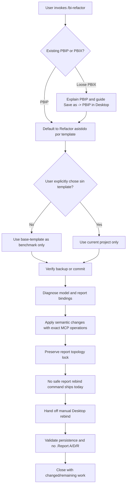

# BI Refactor Flow

## Notes

- `base-template` is a benchmark, not a file to paste over the project.
- PBIP + Git gives text diffs, rollback, reviews, and team workflow.
- The report topology lock is stricter than convenience: never rebuild the user's report as a shortcut.
