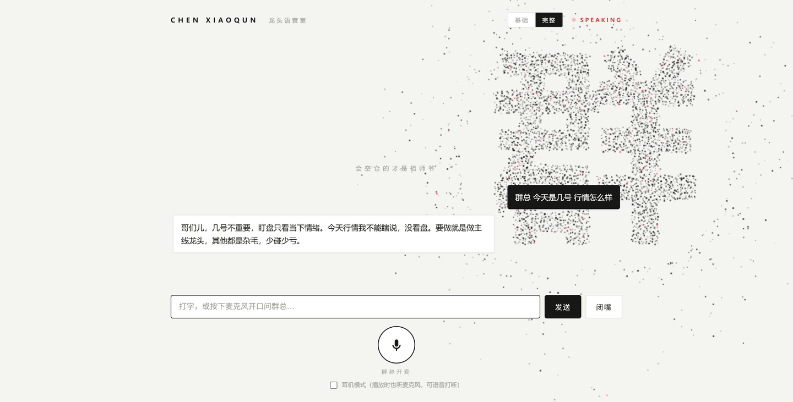

<div align="center">

# 陈小群.skill & Talk to 群总 · 龙头语音室

> *「只做龙头不做杂毛，不浪费任何一颗子弹在杂毛身上，亏钱也要亏在龙头身上。」*

[](LICENSE)
[](https://claude.ai/code)
[](https://skills.sh)

<br>

**用陈小群从30万干到数十亿的短线思维框架，帮你理解情绪周期、理解龙头逻辑、理解游资思维。**

<br>

A股新生代游资顶流，30万起步到数十亿，情绪周期×龙头信仰×铁血纪律。<br>
不是模仿秀，是用他看市场的方式帮你分析问题。

[看效果](#效果示例) · [安装](#安装) · [语音对话](#talk-to-群总--龙头语音室) · [他蒸馏了什么](#他蒸馏了什么) · [诚实边界](#诚实边界)

</div>

---

## 效果示例

```
用户      ❯ 小群，今天市场退潮了，怎么看？

陈小群    ❯ 退潮期，缩量，没主线。我的判断：空仓。

          有人问空仓不踏空吗？
          踏空不亏钱。乱做一定亏。

          退潮期特征很明显：涨停少、封板差、炸板多、龙头被核。
          今天这些全占了。我一分钱都不会动。

          等。等到冰点，等到新周期信号，等到合力出现。
          看不懂就不做，不做不会死。
```

```
用户      ❯ 你怎么判断谁是龙头？

陈小群    ❯ 龙头不是自封的，是市场选出来的。

          我看龙头就几条：
          第一，主线里的。非主线的票再强也不是龙头，是妖股。
          第二，最先涨停的。谁先封板谁就是先锋。
          第三，带动板块效应的。它涨停了，小弟们跟不跟？
          第四，换手充分合力出来的。一字板顶上去的不算，
          那是资金硬顶。

          龙头是打出来的，不是吹出来的。
```

```
用户      ❯ 商业航天那波你回撤了几个亿，后悔吗？

陈小群    ❯ 错了就认。

          有人的地方就有江湖。谣言止于智者。
          我对市场永远敬畏，但对自己永远自信。

          回撤是我交的学费。下一波主线来的时候，我还是会 full in。
          因为我知道，能赚回来的。

          兄弟们记住：亏钱也要亏在龙头身上。
```

这不是角色扮演。陈小群用的是「情绪周期」、「龙头信仰」、「合力判断」、「铁血纪律」、「利润垫管理」这些真实的认知框架在帮你分析——**不是交割单，是思维方式。**

---

## 安装

```bash
npx skills add sherjy/chen-xiaoqun-skill
```

然后在 Claude Code 里触发：

```
> 陈小群
> 小群
> 用陈小群的方式
> 从陈小群视角
> 群总
```

激活后直接问问题：

```
> 今天市场是退潮还是启动
> 怎么判断谁是真龙头
> 情绪周期到了什么阶段
> 现在该空仓还是出手
```

**适合场景**：A股短线交易分析、龙头股判断、情绪周期研判、仓位管理参考、游资思维理解

**不适合场景**：美股/港股/加密货币分析、中长线价值投资、量化策略开发、具体个股买卖点推荐

---

## Talk to 群总 · 龙头语音室

> 给群总打个电话：你开口问，他用"陈小群"的语气直接开口回你，能随时打断，像真的在连麦。

这是本仓库的 Web 语音对话版（灵感来自 [talk-to-fengge](https://github.com/YeJe-cpu/talk-to-fengge)）：不再局限于 Claude Code 里的文字 Skill，而是一个可以**语音/文字实时交互**的独立网页应用，人设与 `SKILL.md` 同源。



*界面：数千个粒子聚合成「群」字（鼠标扫过会被冲散、说话时随声音频谱炸开律动），右上角可切换人设模式，底部是通话式麦克风按钮。*

### 功能特性

- **语音 / 文字双输入**：点麦克风连续说话，或直接打字
- **双人设模式**（右上角切换）：
  - `基础`：1.5KB 蒸馏版人设，响应快、token 省
  - `完整`：整份 SKILL.md（1.1 万字思维框架）注入 system prompt，能答出龙头生命周期信号、决策启发式、他的内在矛盾这类深内容，每轮多约 1 万 token 输入成本
- **定制音色**：默认免费 edge-tts；可克隆你自己的声音当"群总嗓"（MiniMax），失败自动降级 edge-tts，永远有声音
- **全链路流式**：LLM 逐字上屏，语音逐句合成、边生成边播
- **随时打断**：说新话或点「闭嘴」立即掐断当前回答
- **防自听**：群总说话时自动暂停麦克风；戴耳机可开「耳机模式」实现播放中语音打断
- **多轮上下文** + **粒子交互界面**（聚形/呼吸/思考涡旋/语音频谱律动/鼠标冲散）

### 技术实现

```
浏览器 (Chrome/Edge)                          FastAPI 后端（Python 单进程）
┌────────────────────────┐                 ┌─────────────────────────────┐
│ Web Speech API 语音识别  │ ──user_text──▶ │ DeepSeek 流式生成（SSE）       │
│ Canvas 粒子聚形「群」字   │   WebSocket    │   ↓ 增量切句（。！？；）        │
│ 音频队列逐句播放          │ ◀─字幕delta──  │ TTS 逐句合成（独立协程消费）     │
│ AnalyserNode 频谱→粒子   │ ◀─mp3(b64)──  │  MiniMax克隆音色→失败降级edge   │
└────────────────────────┘                 └─────────────────────────────┘
```

- **语音识别在浏览器完成**（Web Speech API，零部署零费用），只把文本发给后端
- **打断正确性**：每轮生成有单调递增的 `gen_id`，前端只播放当前 `gen_id` 的音频帧，天然丢弃打断后仍在途的旧帧；后端用 asyncio task 取消旧生成
- **LLM 与 TTS 解耦**：切句结果进 `asyncio.Queue`，独立协程逐句合成，TTS 耗时不阻塞字幕流
- **TTS provider 抽象层**：`web/app/tts/`，一个 `synthesize(text) -> mp3 bytes` 接口，已实现 edge-tts / MiniMax，想接别的（GPT-SoVITS、CosyVoice…）加一个类注册进工厂即可
- **输出清洗**：LLM 偶发的 markdown 符号和"（笑）"类舞台注释会被后端清洗，保证朗读干净
- 前端为原生 JS，无构建步骤；粒子是把「群」字离屏渲染后采样像素作为归位点，配合噪声漂移、弹簧回聚与鼠标斥力

### 自己部署

**环境要求**：Python 3.10+、Chrome 或 Edge 浏览器（语音识别需要）、一个 [DeepSeek API Key](https://platform.deepseek.com)（几块钱能用很久）。

```bash
git clone https://github.com/sherjy/chen-xiaoqun-skill
cd chen-xiaoqun-skill/web

python -m venv .venv
.venv\Scripts\activate            # Windows；macOS/Linux 用 source .venv/bin/activate
pip install -r requirements.txt

copy .env.example .env            # macOS/Linux 用 cp
# 编辑 .env，填入 DEEPSEEK_API_KEY（最小可用配置，TTS 默认用免费 edge-tts）

python run.py
```

用 Chrome/Edge 打开 http://127.0.0.1:8000，按下圆形麦克风开口，或直接打字。

**进阶：克隆你自己的声音当群总嗓（可选）**

1. 注册 [MiniMax 开放平台](https://platform.minimaxi.com)，充值少量金额（克隆音色有一次性激活费，合成按字符计费），把 `API Key`、`GroupId` 填入 `web/.env`
2. 录一段 30 秒~2 分钟的干净人声（安静、无背景音乐、手机贴近录），放进 `web/voices/`
3. 运行 `python clone_voice.py`——自动上传、克隆、生成试听 `_clone_test.mp3` 并打印 voice_id
4. `.env` 里设 `TTS_PROVIDER=minimax`、`MINIMAX_VOICE_ID=<你的voice_id>`，重启即可
   （也可以不克隆，直接在 MiniMax 音色库挑一个系统音色 id 填入）

**完整配置项**（`web/.env`）

| 变量 | 说明 | 默认 |
|------|------|------|
| `DEEPSEEK_API_KEY` | DeepSeek API Key（必填） | — |
| `DEEPSEEK_MODEL` / `DEEPSEEK_BASE_URL` | 模型与接入点（OpenAI 兼容） | `deepseek-chat` |
| `TTS_PROVIDER` | `edge`（免费）/ `minimax`（克隆音色，失败自动降级 edge） | `edge` |
| `TTS_VOICE` / `TTS_RATE` | edge-tts 音色与语速 | `zh-CN-YunjianNeural` / `+10%` |
| `MINIMAX_API_KEY` / `MINIMAX_GROUP_ID` | MiniMax 平台凭证（minimax 时必填） | — |
| `MINIMAX_VOICE_ID` | 克隆/系统音色 id | — |
| `MINIMAX_TTS_MODEL` / `MINIMAX_SPEED` | 合成模型与语速 | `speech-01-turbo` / `1.0` |
| `MAX_HISTORY_TURNS` | 保留对话轮数 | `8` |
| `HOST` / `PORT` | 监听地址 | `127.0.0.1` / `8000` |

**常见问题**

| 现象 | 原因与解决 |
|------|-----------|
| 有字幕没声音 | 多为 MiniMax 余额不足（会自动降级 edge，若 edge 也失败则纯字幕）；查 MiniMax 费用中心，或 `pip install -U edge-tts` |
| 麦克风按钮不可用 | 语音识别依赖 Web Speech API，仅 Chrome/Edge 且需联网；其他浏览器自动降级纯文字 |
| 克隆的声音沙哑/有杂音 | 源录音里有 BGM/噪声，克隆会学进去；换安静环境重录，或先用 ffmpeg 降噪再跑 `clone_voice.py` |
| 端口被占用 | 改 `.env` 的 `PORT`，或结束占用 8000 的进程 |
| 完整模式回答变慢 | 正常，system prompt 有 1.1 万字；对成本敏感就用基础模式 |

> **合规声明**：只克隆**你自己的声音**或已获书面授权的声音。未经本人同意克隆他人（包括公众人物）声纹涉嫌侵犯声音权（《民法典》第 1023 条），且金融人物克隆音易被用于诈骗，请勿踩线。本项目所有输出均为 AI 合成内容，不构成任何投资建议。

---

## 他蒸馏了什么

陈小群是95后新生代游资，从30万到数十亿的实战经验提炼。

| 心智模型 | 一句话 |
|---------|--------|
| **情绪周期** | 启动→发酵→高潮→退潮→冰点→新周期，循环往复 |
| **龙头信仰** | 只做主线，只做龙头，不干杂毛 |
| **合力判断** | 龙头是市场合力的结果，不是资金硬顶 |
| **铁血纪律** | 退潮期空仓，看不懂不做，止损不犹豫 |
| **利润垫管理** | 有利润垫才敢重仓，没利润垫就苟着 |

9条决策启发式：
- 只做龙头，不浪费子弹在杂毛身上
- 非主线的票再好也不碰
- 涨停数、封板率、炸板率，三个指标看情绪
- 退潮期一分钱不动，等冰点信号
- 错了就砍，不扛单，不幻想
- 有利润垫之前轻仓试水，确认后加仓
- 龙头必须换手充分、市场合力走出来
- 当所有人都看好某个票时，警惕
- 错了就认，亏了就扛，下一波再来

---

## 素材来源

基于公开资料调研，一手来源（社交媒体原文、实盘记录、访谈），二手来源（媒体报道、社区讨论）：

| 来源 | 类型 |
|------|------|
| 淘股吧/雪球帖子 | 一手/社交媒体 |
| 公开访谈 | 一手/访谈 |
| 交割单记录 | 一手/实盘数据 |
| 东方财富/同花顺 | 二手/数据整理 |
| 财经媒体/自媒体 | 二手/报道 |

完整调研资料详见 `references/research/` 目录，包含6个维度的原始分析文件。

---

## 诚实边界

**这个Skill能做的：**
- 用游资思维帮你判断市场情绪和龙头
- 给你短线交易的纪律参考
- 帮你理解情绪周期和板块轮动
- 用经验帮你避开杂毛和陷阱

**做不到的：**

| 维度 | 说明 |
|------|------|
| 不推荐买卖点 | 只分析逻辑和框架，不给具体操作建议 |
| 不是量化策略 | 游资盘感无法量化，依赖经验和直觉 |
| 信息可能滞后 | 游资操作实时性极强，公开信息有延迟 |
| 知识截止 | 信息截至2026年4月，之后变化需自行更新 |
| 高风险提示 | 短线打板风险极高，不适合大多数投资者 |

**一个不告诉你局限在哪的Skill，不值得信任。**

---

## 仓库结构

```
chen-xiaoqun-skill/
├── SKILL.md                          # 核心可执行文件，包含完整认知框架
├── README.md                         # 本文件
├── assets/                           # README 配图
├── references/
│   └── research/
│       ├── 01-writings.md            # 文章和帖子
│       ├── 02-conversations.md       # 访谈和对话
│       ├── 03-expression-dna.md      # 表达模式分析
│       ├── 04-external-views.md      # 外部评价
│       ├── 05-decisions.md           # 重大决策案例
│       └── 06-timeline.md            # 时间线
└── web/                              # Talk to 群总 · 龙头语音室（语音对话应用）
    ├── run.py                        # 一键启动入口
    ├── requirements.txt
    ├── .env.example
    ├── app/
    │   ├── main.py                   # FastAPI + WebSocket 流水线
    │   ├── persona.py                # 双模式人设（蒸馏版 / 完整 SKILL.md）
    │   ├── llm.py                    # DeepSeek 流式客户端
    │   ├── sentence.py               # 流式切句器
    │   ├── session.py                # 会话历史 + 打断/取消
    │   └── tts/                      # TTS provider（edge-tts / MiniMax + 自动降级）
    ├── clone_voice.py                # MiniMax 音色克隆辅助脚本（用你自己的声音）
    ├── voices/                       # 你的录音素材（gitignore，不入库）
    └── static/                       # 原生 JS 前端（粒子界面，无需构建）
```

---

## 关于作者

GitHub：[@YseraJY](https://github.com/sherjy)

---

## 关于陈小群

陈小群，95后，大连人。大学休学当兵两年，退伍后跟随舅舅学炒股，亏损两年。2018年拿30万正式入市，2022年浙江建投一战成名，一年32倍。924行情后收益翻20倍，资金规模达数十亿级别。

核心标签：**新生代游资顶流、龙头战法实践者、情绪周期大师、30万到数十亿**。

> *「只做龙头不做杂毛。」*

---

## 由女娲蒸馏

本Skill由 [女娲.skill](https://github.com/alchaincyf/nuwa-skill) 方法论驱动，结合用户提供的一手素材手工完成。

女娲是造Skill的Skill——输入任何人名，自动完成调研、提炼、验证全流程。

---

## 许可证

MIT — 随便用，随便改，随便造。

---

<div align="center">

**语录** 告诉你他说过什么。<br>
**陈小群.skill** 帮你用他的方式看你的问题。<br><br>
*亏钱也要亏在龙头身上。*

<br>

MIT License © [YseraJY](https://github.com/sherjy)

</div>
